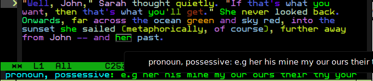

speech-tagger
=============



You know what parts of speech are, but you've never seen them like this! In full living technicolor, language arises right before your very eyes!

This is a program in two parts. The [clojure](clj/speech_tagger) section reads json in stdin (see [core.clj](clj/speech_tagger/core.clj)) and returns json characterizing parts of speech in that text using [corenlp](http://nlp.stanford.edu/software/corenlp.shtml). This is used in an [emacs extension](emacs/speech-tagger.el) (MELPA link incoming when accepted).

# Dependencies

Emacs and the `java` command on your PATH. For development, requires [lein](http://leiningen.org/) to build clojure.

# Install

For users: just install the `speech-tagger` package from [MELPA](https://melpa.org/).

For devs: `load` [the el file](emacs/speech-tagger.el), or add it to `load-path` and `(require 'speech-tagger)`. Run `lein uberjar` to produce the standalone jar, then move that to `emacs/speech-tagger.jar`, or alternatively just customize `speech-tagger-jar-path` to point to the compiled jar. The melpa-build branch contains the compiled jar so that the entire package can be easily downloaded to MELPA.

# Usage

The interactive functions exported by this extension follow a common protocol: if a region is active, then modify the region; otherwise modify the entire buffer. If a prefix argument is provided, they read in a buffer to modify the entirety of. A given region will be expanded to whitespace boundaries (so if region is around the `l` characters in ` he|ll|o `, the entirety of `|hello|` will be selected).

```emacs-lisp
(speech-tagger-tag-dwim (pfx)
```
Tag parts of speech in the appropriate region. "dwim" is an abbreviation for "do what I mean;" hopefully what I the developer mean is close enough to what you the user mean. Tagging, as shown in the image above, colors a part of speech and adds a tooltip to it so that if you mouse over or move point over the part of speech, you get a description of the part of speech and example of that part of speech.

```emacs-lisp
(speech-tagger-clear-tags-dwim (pfx)
```
As above, but clears the region of all such tags.

# Customization

```emacs-lisp
(defcustom speech-tagger-jar-path
```
Path to jar file used to tag parts of speech. Normal users won't need to touch this since it's included in the MELPA package, but developers may find it useful.

# Utilities

```emacs-lisp
(speech-tagger-clear-state ()
```
Useful in the case that something screws up and you wish to debug. Should revert all lisp code back to the same as when first loaded. This isn't autoloaded, so you'll have to explicitly `(require 'speech-tagger)` or have already used one of the autoloaded functions.

# Why?

Honestly? I was bored. I've taken enough language classes to be able to characterize parts of speech without a computer by my side. Maybe I'll think of a use for nlp integration in text editors at some point in the future.

A friend of mine said it might be cool if I was to tag parts of speech in a separate language, then offer a translation of that text. It might be pretty cool to offer that, in addition to a google translation of the text. Tagging parts of speech in all the languages corenlp supports might be useful for teaching? We'll see.

# License

[GPL](GPL.md)
